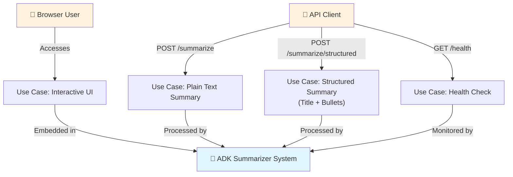
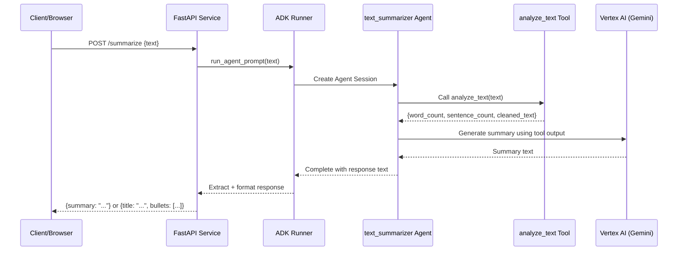
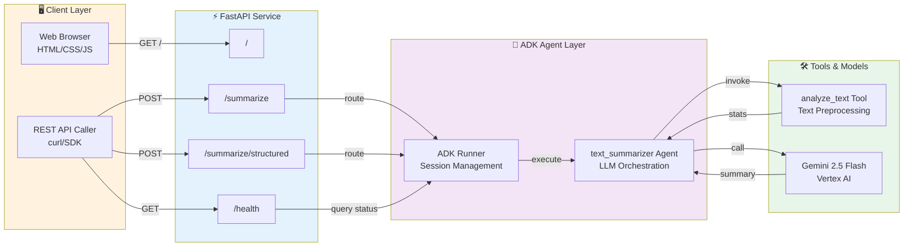

# ADK Text Summarizer (Cloud Run)

A minimal Google ADK agent deployed behind FastAPI on Cloud Run.

## What It Does

- Serves a browser UI at `GET /` for interactive summarization
- Exposes operational health at `GET /health`
- Accepts text via `POST /summarize`
- Accepts structured summary requests via `POST /summarize/structured`
- Uses a Google ADK agent with Gemini (`gemini-2.5-flash` by default)
- Returns a concise summary as JSON
- Enforces structured summary contract: `title` + `bullets` (3-5 items)

## Agent Workflow

1. Input text is received via API.
2. `analyze_text` tool is invoked to preprocess text and extract metadata.
3. Gemini model generates the summary using tool output.
4. Response is returned as plain text (`/summarize`) or structured JSON (`/summarize/structured`).

## System Architecture

### Use-Case Diagram



### Request Processing Flow



### Component Interaction Diagram



## Project Files

- `agent.py`: ADK root agent and tool registration
- `main.py`: FastAPI app and ADK runner orchestration
- `requirements.txt`: Python dependencies
- `Dockerfile`: Container image build definition

## Local Run

1. Create and activate a virtual environment.
2. Install dependencies:

```bash
pip install -r requirements.txt
```

3. Configure Vertex auth and env values:

```bash
# Required once on your machine for Vertex ADC auth
gcloud auth application-default login
```

```bash
# .env (recommended)
MODEL=gemini-2.5-flash
GOOGLE_CLOUD_PROJECT=YOUR_PROJECT_ID
GOOGLE_CLOUD_LOCATION=us-central1
GOOGLE_GENAI_USE_VERTEXAI=true
# Optional aliases accepted by this project:
PROJECT_ID=YOUR_PROJECT_ID
LOCATION=us-central1
```

Or set variables directly in PowerShell:

```bash
# PowerShell
$env:MODEL="gemini-2.5-flash"
$env:GOOGLE_GENAI_USE_VERTEXAI="true"
```

If your environment is Vertex-backed, also set:

```bash
# PowerShell
$env:GOOGLE_CLOUD_PROJECT="YOUR_PROJECT_ID"
$env:GOOGLE_CLOUD_LOCATION="us-central1"
```

4. Start service:

```bash
python main.py
```

5. Test:

Open the UI in your browser:

```bash
http://localhost:8080/
```

Health endpoint:

```bash
curl http://localhost:8080/health
```

```bash
curl -X POST http://localhost:8080/summarize \
  -H "Content-Type: application/json" \
  -d '{"input":"Artificial intelligence is transforming healthcare, finance, and logistics by improving predictions, reducing manual work, and enabling new products."}'

curl -X POST http://localhost:8080/summarize/structured \
  -H "Content-Type: application/json" \
  -d '{"input":"Artificial intelligence is transforming healthcare, finance, and logistics by improving predictions, reducing manual work, and enabling new products."}'
```

## Deploy To Cloud Run

Deploy with Vertex model configuration:

```bash
gcloud config set project YOUR_PROJECT_ID
gcloud services enable run.googleapis.com artifactregistry.googleapis.com cloudbuild.googleapis.com
gcloud run deploy adk-summarizer \
  --source . \
  --region us-central1 \
  --allow-unauthenticated \
  --set-env-vars "MODEL=gemini-2.5-flash,GOOGLE_GENAI_USE_VERTEXAI=true,GOOGLE_CLOUD_PROJECT=YOUR_PROJECT_ID,GOOGLE_CLOUD_LOCATION=us-central1"
```

In PowerShell, keep the full `--set-env-vars` value in quotes so variables are set correctly.

If you receive a model access 404 in your project/region, temporarily fall back to:

```bash
MODEL=gemini-1.5-flash
```

Grant runtime access to Vertex AI for your Cloud Run service account:

```bash
PROJECT_NUMBER=$(gcloud projects describe YOUR_PROJECT_ID --format='value(projectNumber)')
SERVICE_ACCOUNT="${PROJECT_NUMBER}-compute@developer.gserviceaccount.com"
gcloud projects add-iam-policy-binding YOUR_PROJECT_ID \
  --member="serviceAccount:${SERVICE_ACCOUNT}" \
  --role="roles/aiplatform.user"
```

Get URL:

```bash
gcloud run services describe adk-summarizer --region us-central1 --format 'value(status.url)'
```

After deployment, opening the service URL serves the frontend UI. API endpoints remain available at `/health`, `/summarize`, and `/summarize/structured`.

## IAM And Security Notes

- For evaluation/public testing, `--allow-unauthenticated` is simplest.
- For restricted access, remove that flag and grant invoker role:

```bash
gcloud run services add-iam-policy-binding adk-summarizer \
  --region us-central1 \
  --member=user:you@example.com \
  --role=roles/run.invoker
```

- This project uses Vertex IAM-based auth (ADC/service account), not API-key auth.

## Smoke Tests

Run lightweight endpoint tests:

```bash
pytest -q
```

## Quick Curl Script

Use the helper script for local or deployed endpoint checks:

```bash
# Local default (http://localhost:8080)
bash scripts/check_endpoints.sh

# Cloud Run URL
bash scripts/check_endpoints.sh https://YOUR-CLOUD-RUN-URL
```

## CI

GitHub Actions workflow runs `pytest -q` on every push:

- `.github/workflows/ci.yml`

## Author

Sabarish R  
sabarish.edu2024@gmail.com  
https://www.linkedin.com/in/sabarishr08
